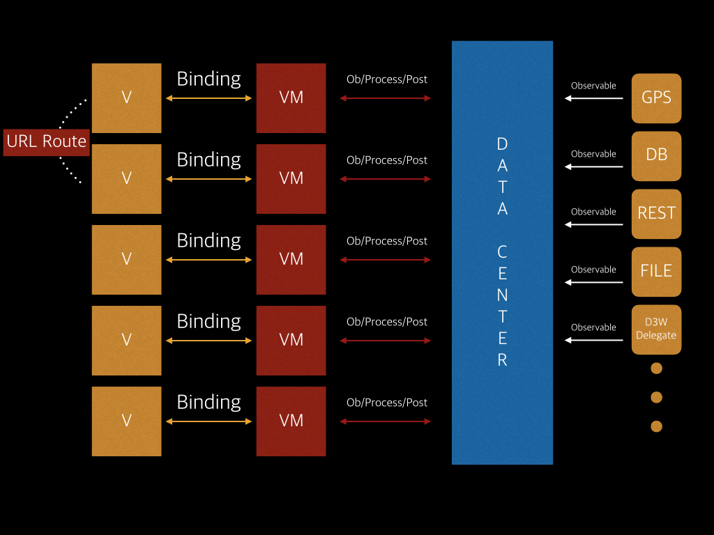

# RxGitSearch

RxGitSearch is demo app for iOS. It use some Rx techniques to achieve flexible, auto ui update, no depencies and others. If you're wandering how to use Rx for real app, I hope RxGitSearch may help you! If you are Korean, You can see [my slideshare](http://www.slideshare.net/skyfe79/rx-for-ios-app-rxmvvmdatacenter) why removing dependency is important. 

[](http://www.youtube.com/watch?v=NZPmzd2_UZA)

## Using Techs
* RxMVVM-DataCenter
 * 	If you are unfamiliar with RxMVVM-DataCenter architecture, I recommend you to read Ribot Tech Blog first. [Android Application Architecture](https://medium.com/ribot-labs/android-application-architecture-8b6e34acda65#.gbqrq9oib)
* URL Route for ViewController navigation
 * URL Route can remove dependencies among ViewControllers than Apple's UISegue. Ofcourse UISegue can remove dependencies among viewcontrollers only just for transition. However, If you want to inject some data to the destination viewcontroller, you should cast destinationViewController to specific your viewcontroller on prepareSegue method. Here is the place that strong dependency is created.

## RxMVVM-DATACENTER



### You can post & receive big data to & from DataCenter like belows.

```swift
// post some data which is binded to id to DataCenter
DataCenter.instance.post(String(id), value: repo)
```

```swift
// receive some data which is bined to id as Observable
DataCenter
    .instance
    .receive(id!)?
    .asObservable()
    .subscribeNext { [unowned self] (value: Any) -> Void in
        if let repo = value as? Repository {
            self.repo = repo
            self.owner = repo.owner
        }
    }
    .addDisposableTo(disposeBag)
```

### You can navigation among view controllers via URL
```swift
Route.push(self, url: "http://repository/detail/\(id)") { (vc, result) in
	// Here is callback block which is called when you call Route.back() method.
	// You can dismiss or pop using vc. vc is UIViewController instance and result is some data from vc.
}
```

```swift
//example for pushing
Route.push(self, url: "http://repository/detail/\(id)") { (vc, result) in
        
    vc.navigationController?.popViewControllerAnimated(true)
    
    let alert = UIAlertController(title: "WOW", message: String(result!), preferredStyle: UIAlertControllerStyle.ActionSheet)
    let action = UIAlertAction(title: "OK", style: UIAlertActionStyle.Default, handler: { action in
        alert.dismissViewControllerAnimated(true, completion: nil)
    })
    alert.addAction(action)
    self.presentViewController(alert, animated: true, completion: nil)
}
```

```swift
//example for backing route
backButton
	.rx_tap
	.subscribeNext { [unowned self] in
	    
	    if let fullname = self.viewModel.repoFullName() {
	        Route.back("app://repository/detail/:id", from: self, result: "Wow, You're back from " + fullname)
	    } else {
	        Route.back("app://repository/detail/:id", from: self, result: "Wow, You're Back!")
	    }
	    
	}
	.addDisposableTo(disposeBag)
```

* You can remove every dependencies among ViewController using URL-Route!

## Using Libraries

* Rx
 * RxSwift
 * RxCocoa
 * RxAlamofire
* HTTP-Request
 * Alamofire
* JSON-OBJECT MAPPER
 * ObjectMapper
 * AlamofireObjectMapper     

## The MIT License (MIT)

Copyright (c) 2016 Sungcheol Kim, [https://github.com/skyfe79/RxGitSearch](https://github.com/skyfe79/RxGitSearch)

Permission is hereby granted, free of charge, to any person obtaining a copy
of this software and associated documentation files (the "Software"), to deal
in the Software without restriction, including without limitation the rights
to use, copy, modify, merge, publish, distribute, sublicense, and/or sell
copies of the Software, and to permit persons to whom the Software is
furnished to do so, subject to the following conditions:

The above copyright notice and this permission notice shall be included in all
copies or substantial portions of the Software.

THE SOFTWARE IS PROVIDED "AS IS", WITHOUT WARRANTY OF ANY KIND, EXPRESS OR
IMPLIED, INCLUDING BUT NOT LIMITED TO THE WARRANTIES OF MERCHANTABILITY,
FITNESS FOR A PARTICULAR PURPOSE AND NONINFRINGEMENT. IN NO EVENT SHALL THE
AUTHORS OR COPYRIGHT HOLDERS BE LIABLE FOR ANY CLAIM, DAMAGES OR OTHER
LIABILITY, WHETHER IN AN ACTION OF CONTRACT, TORT OR OTHERWISE, ARISING FROM,
OUT OF OR IN CONNECTION WITH THE SOFTWARE OR THE USE OR OTHER DEALINGS IN THE
SOFTWARE.
